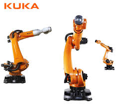
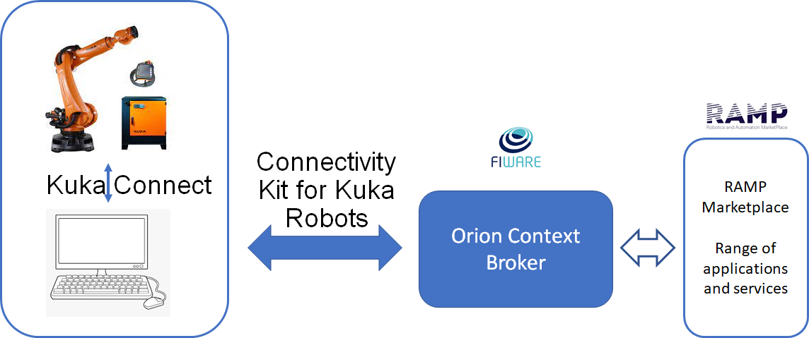
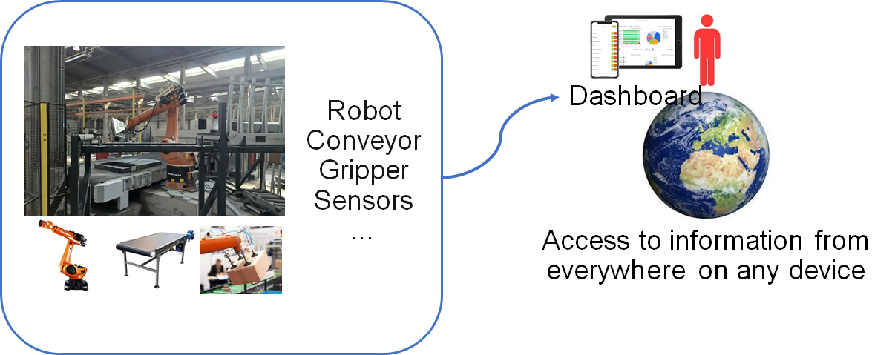

# Connectivity Kit for Kuka  Robots

(making use of KukaConnect software option)

This project is part of [FIWARE](https://www.fiware.org/). For more information check the FIWARE Catalogue entry for
[<chapter>](https://github.com/Fiware/catalogue/tree/master/<chapter>).

## Introduction

This Rose-AP is an “Open Source” component which has a generic basis. A predefined set of robot-data is extracted from the robot and piped to the context broker. If other information needs to be available, you can follow a tutorial to extend the “open source” code with these extra features.

Software architecture :

The ROSE-AP will be defined as a software application (within the iPC infrastructure) and consists of :

·    The north port and its standard NGSI interface to communicate with the Context Broker as NGSI context consumer/provider. The interface consists of a set of CRUD Operations, queries, subscriptions and/or registrations on NGSI Context Data. 

 ·    The south port and its interface to communicate with the Kuka robot through the Kuka Connect Module. The south port interface determines the Kuka Connect Features your ROSE-AP is compliant with.

More into detail there are two different kind of information (variables) that can be active in this :

1. System variables of the robot These variables are read only (cannot be written). Only a kind of registration in the Kuka Connect module is required.
2. In and outputs. These are accessible by the arrays $IN and $OUT through kuka Connect. In one of the follwing sections you can find instructions how to configure the i/o in the robot so that they become readable (robot inputs) and writable (robot outputs) from the south gate of our api. 

As an endpoint for our demonstrations and use cases we use the graphical user interface of Grafana. In this environment we developped a dashboard displaying all properties of the connected robot.

 

 

Benefits :

- By using this ROSE-AP, all owners of Kuka robots can connect simply to the Fiware-ecosystem and make use of all the software components available in RAMP (ex. Grafana).

- The tutorials and the predefined use-cases are an inspiration to start with. In case of the simple implementations, little more is needed but the solution can grow with more advanced requirements. In both cases the development time is considerable shorter by using this ROSE-AP.

## Installation

##### 	Installation of Kuka Connect

- Make sure the Robot Controller is connected to the pc on which the RoseAP is running

- [Installation Guide](./KukaConnect_InstallationGuide.md)

- Configuration of Kuka Connect

- Configuration of the Inputs and outputs of the robot

##### 	Installation of the RoseAP

- Docker Compose file
  - How To Use It
  - installing OCB, Quantumleap ....
  - Make it run

- Configuring the ROSE-AP
- Running the ROSE-AP

##### 	Installation/Configuration of Grafana

 

​                               

 

 

 

 

## Implementation (Use cases)

Our implementation will become the Reference Open Implementation of this ROSE-AP. Others may implement themselves a similar ROSE-AP by developing a module that accounts for the same interfaces based on the Open Implementation. 

 

To allow people to test upfront a simplified implementation of the ROSE-AP, we would make a container-based (docker) implementations of the ROSE-AP as binaries that may be used for testing purposes. For this purpose a predefined set of robot-data is extracted from the robot and piped to the context broker.

 

 

•      A set of atomic tests will be defined, each one in charge of showcasing one workflow from the following types:

\1.   (Robot as a Context Data Provider Provider)  : Kuka Connect Feature -> ROSE-AP South Port -> ROSE-AP North Port -> Context Broker -> Endpoint 

\2.   (Robot as a Context Data Consumer) : Endpoint -> Context Broker -> ROSE-AP North Port -> ROSE-AP south Port -> Kuka Connect Feature

 

When user download the API it is obvious that they do not have a virtual robot available to test with. This makes it impossible to create a use case that allows the user to see and examinate in detail the behaviour of the API. 

To tackle this shortcoming we will work out two use cases in detail (out of our own applications from the past years) and document this in detail. 

 
The first level is Condition monitoring. It stays close to what we have done in the experiment. It should be easily reachable though can give already added value to the user.

A second level could allow the user to do some ‘Configuration of the application’. In this case some key variables will become controllable for the user. 

 

