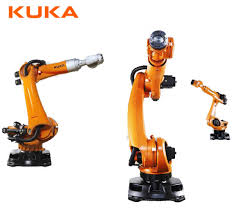

## Rose-AP Connectivity Kit for Kuka  Robots             

(making use of the KukaConnect software option)

 

This software allows all owners of Kuka robots to connect to the Fiware-ecosystem and make use of all the software components available
in RAMP (ex. Grafana). The tutorials and the predefined use-cases are an inspiration to start with. In case of the simple implementations, l
ittle more is needed but the solution can grow with more advanced requirements. In both cases the development time is considerable 
shorter by using this ROSE-AP.

This project is part of [DIH^2](http://www.dih-squared.eu/). For more information check the RAMP Catalogue entry for the
[components](https://github.com/xxx).

| :books: [Documentation](https://js2sf.readthedocs.io/en/latest/) | :whale: [Docker Hub](https://hub.docker.com/r/link-to-docker) |
| --------------------------------------------- | ------------------------------------------------------------- |

## Contents

-   [Background](#background)
-   [Getting Started](#gettingstarted)
-   [Install](#install)
-   [Usage](#usage)
-   [API](#api)
-   [Testing](#testing)
-   [License](#license)
-   [youtube](#youtube)

## Background

This Rose-AP is an “Open Source” component which has a generic basis. A predefined set of robot-data is extracted from the robot and piped to a context broker. If other information needs to be available, you can follow a tutorial to extend the “open source” code with these extra features.

Software architecture :

The ROSE-AP will be defined as a software application (within the iPC infrastructure) and consists of :

·    The north port and its standard NGSI interface to communicate with the Context Broker as NGSI context consumer/provider. The interface consists of a set of CRUD Operations, queries, subscriptions and/or registrations on NGSI Context Data. 

 ·    The south port and its interface to communicate with the Kuka robot through the Kuka Connect Module. The south port interface determines the Kuka Connect Features your ROSE-AP is compliant with.

More into detail there are two different kind of information (variables) that can be active in this :

1. System variables of the robot These variables are read only (cannot be written). Only a kind of registration in the Kuka Connect module is required.
2. In and outputs. These are accessible by the arrays $IN and $OUT through kuka Connect. In one of the following sections you can find instructions how to configure the i/o in the robot so that they become readable (robot inputs) and writable (robot outputs) from the south gate of our api. 

As an endpoint for our demonstrations and use cases we use the graphical user interface of Grafana. In this environment we developed a dashboard displaying all properties of the connected robot.

 

## Getting Started

[In this section you will find a way to test the component. ](docs/getting-started.md)

## Install and configure

More information about how to install the connectivity kit can be found at the corresponding section of the
[Installation & Administration Guide](docs/installationguide.md).

A `Dockerfile` is also available for your use - further information can be found [here](https://github.com/ramp-eu/JS2SF/tree/master/docker)

## Usage

Information about how to use the the connectivity kit can be found in the [User & Programmers Manual](docs/usermanual.md).

## API

More information about  the internal structure  (available functions and use data model)of the RoseAp can be found in [API documentation](docs/api.md)

## YouTube 
In the you tube channel you can find videos demonstrating the step by step tutorial.
https://studio.youtube.com/channel/UCkh0eWQhH2lQIPBhh5GVMGg/videos/upload?filter=%5B%5D&sort=%7B%22columnType%22%3A%22date%22%2C%22sortOrder%22%3A%22DESCENDING%22%7D

## Testing

When users download the API it is obvious that they do not have a virtual robot available to test with. This makes it impossible to create a use case that allows the user to see and examinate in detail the behaviour of the API. To overcome this we developped a limited robotsimulator.

##### Upfront testing with limited functionality

To allow people to test upfront an implementation of the ROSE-AP, we made a container-based (docker) implementation of the ROSE-AP as binaries that may be used for testing purposes. For this purpose a predefined set of robot-data is extracted from the robot and piped to the context broker.

[Following documents](docs/getting-started.md) will guide you through a quick test setup of the demonstrator.

By changing the values in the Robot Simulator, you can see the changing values in the dashboards.

##### Atomic tests

To allow the user to experiment with the data and the RoseAP a document is created with a set of simple test commands. As wel c# commands and Curl commands are foreseen. You can find them [here](docs/api.md) .

  

## License

[Apache2.0](LICENSE) © 2021 Optidrive<TTE>
