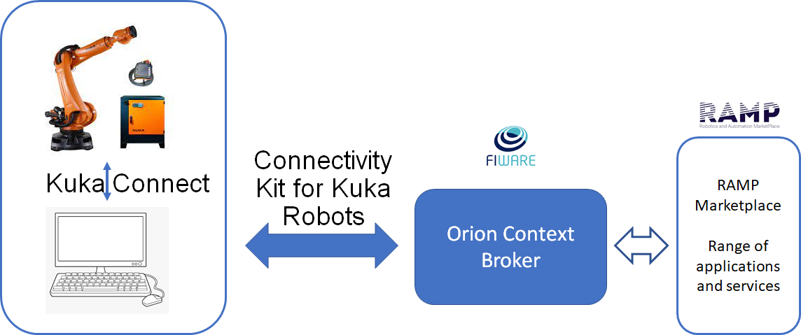
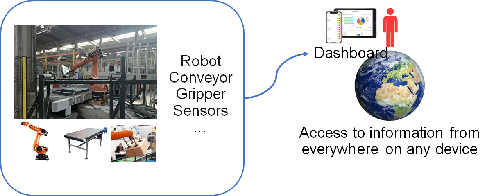

## Connectivity Kit for Kuka  Robots             
<hr />

(making use of KukaConnect software option)


[](https://opensource.org/licenses/MIT)
[](https://hub.docker.com/r/<org>/<repo>/)
<br/>
[](https://tte-project1.readthedocs.io/en/latest/?badge=latest)
[](https://travis-ci.org/ramp-eu/TTE.project1/)
[](https://coveralls.io/github/ramp-eu/TTE.project1?branch=master)
[](https://app.codacy.com/manual/jason-fox/TTE.project1)
[](https://bestpractices.coreinfrastructure.org/projects/4187)

```text

The Badges above demonstrate testing, code coverage
and commitment to coding standards (since the code is linted on commit).

The links need to be amended to point to the correct repo.

Sign up for:

- CI Test system - e.g. Travis
- A Documentation website - e.g. ReadTheDocs
- Static Code Analysis tool - e.g. Codacy
- CII Best Practices https://bestpractices.coreinfrastructure.org

Only CII Best Practices (and its badge) is mandatory. Any equivalent public automated tools for the other three may be used.

Note that the CII Best Practices questionaire will request evidence of tooling used.

```

```text
One or two sentence preamble describing the element
```

This project is part of [DIH^2](http://www.dih-squared.eu/). For more information check the RAMP Catalogue entry for the
[components](https://github.com/xxx).

| :books: [Documentation](https://tte-project1.readthedocs.io/en/latest/) | :whale: [Docker Hub](https://hub.docker.com/r/link-to-docker) |
| --------------------------------------------- | ------------------------------------------------------------- |


## Contents

-   [Background](#background)
-   [Install](#install)
-   [Usage](#usage)
-   [API](#api)
-   [Testing](#testing)
-   [License](#license)

## Background

This Rose-AP is an “Open Source” component which has a generic basis. A predefined set of robot-data is extracted from the robot and piped to a context broker. If other information needs to be available, you can follow a tutorial to extend the “open source” code with these extra features.

Software architecture :

The ROSE-AP will be defined as a software application (within the iPC infrastructure) and consists of :

·    The north port and its standard NGSI interface to communicate with the Context Broker as NGSI context consumer/provider. The interface consists of a set of CRUD Operations, queries, subscriptions and/or registrations on NGSI Context Data. 

 ·    The south port and its interface to communicate with the Kuka robot through the Kuka Connect Module. The south port interface determines the Kuka Connect Features your ROSE-AP is compliant with.





More into detail there are two different kind of information (variables) that can be active in this :

1. System variables of the robot These variables are read only (cannot be written). Only a kind of registration in the Kuka Connect module is required.
2. In and outputs. These are accessible by the arrays $IN and $OUT through kuka Connect. In one of the following sections you can find instructions how to configure the i/o in the robot so that they become readable (robot inputs) and writable (robot outputs) from the south gate of our api. 

As an endpoint for our demonstrations and use cases we use the graphical user interface of Grafana. In this environment we developed a dashboard displaying all properties of the connected robot.

 

 

Benefits :

- By using this ROSE-AP, all owners of Kuka robots can connect simply to the Fiware-ecosystem and make use of all the software components available in RAMP (ex. Grafana).

- The tutorials and the predefined use-cases are an inspiration to start with. In case of the simple implementations, little more is needed but the solution can grow with more advanced requirements. In both cases the development time is considerable shorter by using this ROSE-AP.


## Install

How to install the component

Information about how to install the connectivity kit can be found at the corresponding section of the
[Installation & Administration Guide](docs/installationguide.md).

A `Dockerfile` is also available for your use - further information can be found [here](docker/README.md)


## Usage


Information about how to use the the connectivity kit can be found in the [User & Programmers Manual](docs/usermanual.md).


## API

More information about  can be found in [API documentation](docs/api.md)


## Testing

A complete Tutorial is worked out for two robots from a stone processing company.


To allow people to test upfront an implementation of the ROSE-AP, we made a container-based (docker) implementation of the ROSE-AP as binaries that may be used for testing purposes. For this purpose a predefined set of robot-data is extracted from the robot and piped to the context broker.

Following documents will guide you through a quick test setup of the demonstrator :

​	Install the OCB and its preconfigured environment using Docker (including Grafana and the dashboards)

​	Run the limited Robot Simulator

​	Run the Rose AP

By changing the values in the Robot Simulator, you can see the changing values in the dashboards.


 A set of atomic tests will be defined, each one in charge of showcasing one workflow from the following types:

\1.   (Robot as a Context Data Provider Provider)  : Kuka Connect Feature -> ROSE-AP South Port -> ROSE-AP North Port -> Context Broker -> Endpoint 

\2.   (Robot as a Context Data Consumer) : Endpoint -> Context Broker -> ROSE-AP North Port -> ROSE-AP south Port -> Kuka Connect Feature

 

When user download the API it is obvious that they do not have a virtual robot available to test with. This makes it impossible to create a use case that allows the user to see and examinate in detail the behaviour of the API. 

To tackle this shortcoming we will work out two use cases in detail (out of our own applications from the past years) and document this in detail.  

## License

[MIT](LICENSE) © <TTE>
