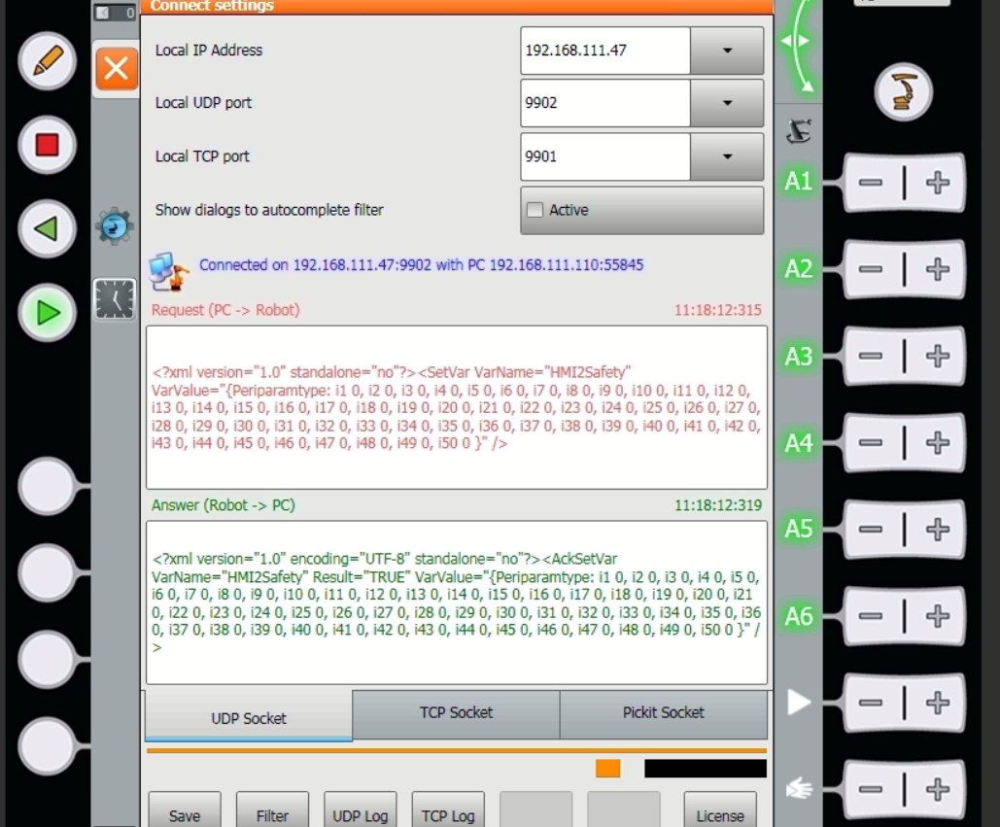

### Introduction

KUKA.Connect KRC provides a socket interface that other pc’s on the network can use to read or write variables in the robot controller.

### Kuka Connect : Configuration

Configuration of the socket interface can be done through the socket configuration window. 

Select “Main menu” -> “Configuration” -> “Connect Settings”. 

Note that this option is only accessible in user mode expert or higher.

 

The displayed properties are :

1) Local IP Address = the ip-address of the robot. 

2) Local UDP Port = the UDP port on which the robot is listening. If the first entry called “disabled” is selected then the robot is not listening to on any UPD port. As a default often 9902 is selected. 

3) Local TCP Port = the TCP port on which the robot is listening. If the first field entry “disabled” is selected then the robot is not listening on TCP any port. As a default often 9901 is selected. 

 

4) Show dialog messages when the socket filter is violated, to easily auto complete the contents of the socketfilter.ini. For safety reasons it is advised to deactivate this option during production. 

5) Connection status icon and message: shows the current state of the UDP and TCP connection 

6) The request textbox shows the latest xml message that the socket interface has received from another pc. 

7) The answer textbox shows the latest xml message that the socket interface has sent out. 

8) A tab panel to switch between the UDP Socket and TCP Socket request and answer messages. The incoming and outgoing telegrams can be observed. 

9) Below this is a part for the license, see the chapter about the license for more information about this part. 

10) The Save button will apply any changes made to the selected ports and restart the connection. 

11) Filter: This button opens an editor that allows you to edit the socket filter configuration. 

12) UDP log: a log file of UDP error messages 

13) TCP log: a log file of TCP error messages 

 

**Note**. When no valid license is available, then the fields such as Local IP Address cannot be filled in. 

**Note:** When configuring the network, avoid the following IP ranges, as they are used by the robot controller for internal purposes 

192.168.0.0 192.168.0.255 

172.16.0.0 172.16.255.255 

172.17.0.0 172.17.255.255 

### Kuka Connect : Socket Filter

The socket filter defines which EndPoint (one other computer or multiple other computers) has access to which variables on the robot. The socket filter can be seen as a whitelist. The socket filter has to be configured by defining variables in an INI file on the robot controller. 

**C:\KRC\User\SocketFilter.ini**

This INI file can be edited using the Filter button. In this INI-file following settings must be made: 

 Host name or IP-address of pc’s in the network which should have permission to access the socket 

 The KRL variables that may be read through the socket interface 

 The KRL variables that may be written through the socket interface 

Contents of the file : 

> [RemoteEndPoint]   ;Host name or IP-address of pc’s in the network which should  have permission to access the socket   
>
> 1=200.0.0.1   
>
> [ReadableData]   ;The KRL Variables that may be read through the socket interface   
>
>  1=$OV_PRO   
>
>  2=$PRO_STATE1   
>
>  3=$TOOL  
>
>  [WritableData]   ;The KRL Variables that may be written through the socket  interface   
>
> 1=$OV_PRO   
>
> 2=
>
> 

| Every  host can connect to the socket. Only the hosts that have permission as a  RemoteEndPoint will receive a correct answer telegram. A host with no  permission to access the socket always receives the following answer:   **Answer  telegram:** |
| ------------------------------------------------------------ |
| <?xml version="1.0" encoding="UTF-8"  standalone="no"?>   <Refused Message="You have no permission to access the  socket interface" /> |

 

When using the connectivity kit for the  socket configuration file should look like this :

It contains the correct IP adress of the pc connected to the robot and all variables which are used by the RoseAP.

