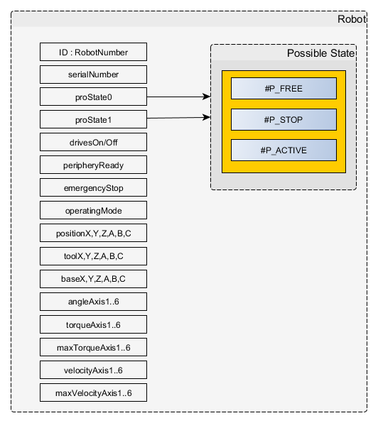

# API

## Foreseen functions available in c#<a name="c#functions"></a>

Hereby a short description of the functions available for every robot. 
#### Functions in ODfiware.cs

- private void UpdateRobotInfo() : updates the data of the Robot, data is known as global variables
- public void ParseRobotconfig(string path) : parse robot config.dat for input and output variables
- public async void AddRobotIO(List<RobotInput> i, List<RobotOutput> o) : Create the Inputs and outputs on the context broker.
- public async void UpdateRobotIO(List<RobotInput> i, List<RobotOutput> o) : Update the Inputs and outputs on the context broker.

## Available Curl commands <a name="curlcommands"></a>

- Show Robot info for robot  with serial number 123456:
```
curl -iX GET --url 'http://localhost:1026/v2/entities?type=Robot&q=serialNumber==123456&limit=1000'
```
- Show Robot proState0 attribute value:
```
vmuser@js2sf:~$ curl -X GET --url 'http://localhost:1026/v2/entities/urn:ngsi-ld:Robot:123456/attrs/proState0/value'
```
result:
```
"#P_ACTIVE"
```
- List all Inputs for robot with serial number 123456
```
curl -iX GET --url 'http://localhost:1026/v2/entities?type=Input&q=robotSerialNumber==123456&limit=1000'
```
- Show Input 'CILDET_7' for robot with serial number 123456:
```
curl -iX GET --url 'http://localhost:1026/v2/entities/urn:ngsi-ld:Input:123456-CILDET_7'
```
- Delete Input 'CILDET_7' for robot with serial number 123456:
```
curl -iX DELETE --url 'http://localhost:1026/v2/entities/urn:ngsi-ld:Input:123456-CILDET_7'
```
- List all Outputs for robot with serial number 123456:
```
curl -iX GET --url 'http://localhost:1026/v2/entities?type=Output&q=robotSerialNumber==123456&limit=1000'
```
- Show Output 'BLOWOFF' for robot with serial number 123456:
```
curl -iX GET --url 'http://localhost:1026/v2/entities/urn:ngsi-ld:Output:123456-BLOWOFF'
```
- Set outputValue to true for  Output 'BLOWOFF' for robot with serial number 123456:
```
curl -iX POST \
  --url 'http://localhost:1026/v2/entities/urn:ngsi-ld:Output:123456-BLOWOFF/attrs' \
  --header 'Content-Type: application/json' \
  --data '{
    "outputValue":{"type":"Boolean", "value": true}
}'
```

## Used data model<a name="datamodel"></a>

The data model exists of entities representing the status variables of the robot. To represent the I/o of the robot the necessary entities are created at startup of the api.

- Model for Robot



- Model definition for Robot

```
curl -iX POST \
  'http://localhost:1026/v2/entities' \
  -H 'Content-Type: application/json' \
  -d '
 {
  "id": "urn:ngsi-ld:Robot:876543",
  "type": "Robot",
  "serialNumber": { "type": "Number", "value": 876543 },
  "proState0": { "type": "Text", "value": "#P_FREE" },
  "proState1": { "type": "Text", "value": "#P_FREE" },
  "drivesOn": { "type": "Boolean", "value": false },
  "drivesOff": { "type": "Boolean", "value": true },
  "peripheryReady": { "type": "Boolean", "value": true },
  "emergencyStop": { "type": "Boolean", "value": false },
  "operatingMode": { "type": "Text", "value": "#AUT" },
  "positionX": { "type": "Number", "value": 45 },
  "positionY": { "type": "Number", "value": 100 },
  "positionZ": { "type": "Number", "value": 200 },
  "positionA": { "type": "Number", "value": 20 },
  "positionB": { "type": "Number", "value": 10 },
  "positionC": { "type": "Number", "value": 15 },
  "toolX": { "type": "Number", "value": 20 },
  "toolY": { "type": "Number", "value": 200 },
  "toolZ": { "type": "Number", "value": 100 },
  "toolA": { "type": "Number", "value": 11 },
  "toolB": { "type": "Number", "value": 33 },
  "toolC": { "type": "Number", "value": 22 },
  "baseX": { "type": "Number", "value": 0 },
  "baseY": { "type": "Number", "value": 0 },
  "baseZ": { "type": "Number", "value": 0 },
  "baseA": { "type": "Number", "value": 0 },
  "baseB": { "type": "Number", "value": 0 },
  "baseC": { "type": "Number", "value": 0 },
  "angleAxis1": { "type": "Number", "value": 10 },
  "angleAxis2": { "type": "Number", "value": 20 },
  "angleAxis3": { "type": "Number", "value": 30 },
  "angleAxis4": { "type": "Number", "value": 40 },
  "angleAxis5": { "type": "Number", "value": 50 },
  "angleAxis6": { "type": "Number", "value": 60 },
  "torqueAxis1": { "type": "Number", "value": 1500 },
  "torqueAxis2": { "type": "Number", "value": 1000 },
  "torqueAxis3": { "type": "Number", "value": 300 },
  "torqueAxis4": { "type": "Number", "value": 0 },
  "torqueAxis5": { "type": "Number", "value": 0 },
  "torqueAxis6": { "type": "Number", "value": 0 },
  "maxTorqueAxis1": { "type": "Number", "value": 4500 },
  "maxTorqueAxis2": { "type": "Number", "value": 4500 },
  "maxTorqueAxis3": { "type": "Number", "value": 4500 },
  "maxTorqueAxis4": { "type": "Number", "value": 4500 },
  "maxTorqueAxis5": { "type": "Number", "value": 4500 },
  "maxTorqueAxis6": { "type": "Number", "value": 4500 },
  "velocityAxis1": { "type": "Number", "value": 6 },
  "velocityAxis2": { "type": "Number", "value": 5 },
  "velocityAxis3": { "type": "Number", "value": 4 },
  "velocityAxis4": { "type": "Number", "value": 3 },
  "velocityAxis5": { "type": "Number", "value": 2 },
  "velocityAxis6": { "type": "Number", "value": 1 },
  "maxVelocityAxis1": { "type": "Number", "value": 100 },
  "maxVelocityAxis2": { "type": "Number", "value": 100 },
  "maxVelocityAxis3": { "type": "Number", "value": 100 },
  "maxVelocityAxis4": { "type": "Number", "value": 100 },
  "maxVelocityAxis5": { "type": "Number", "value": 100 },
  "maxVelocityAxis6": { "type": "Number", "value": 100 }
}'
```

- Model definition of input for robot based on InputNames and InputValues
```
curl -iX POST \
  'http://localhost:1026/v2/entities' \
  -H 'Content-Type: application/json' \
  -d '
{
  "id": "urn:ngsi-ld:Input:876543-Inputname",
  "type": "Input",
  "inputValue": {
    "type": "Boolean",
    "value": true
  },
  "inputNumber": {
    "type": "Number",
    "value": 1
  },
  "dateCreated": {
      "type" : "DateTime",
      "value": "2000-01-01T00:00:00Z"
  },
  "robotSerialNumber": {
    "type": "Number",
    "value": 876543
  }
}'
```
- Model definition of output for robot  based on OutputNames and OutputValues
```
curl -iX POST \
  'http://localhost:1026/v2/entities' \
  -H 'Content-Type: application/json' \
  -d '
{
  "id": "urn:ngsi-ld:Output:876543-Outputname",
  "type": "Output",
  "outputValue": {
    "type": "Boolean",
    "value": true
  },
  "outputNumber": {
    "type": "Number",
    "value": 1
  },
  "dateCreated": {
      "type" : "DateTime",
      "value": "2000-01-01T00:00:00Z"
  },
  "robotSerialNumber": {
    "type": "Number",
    "value": 876543
  }
}'
```
