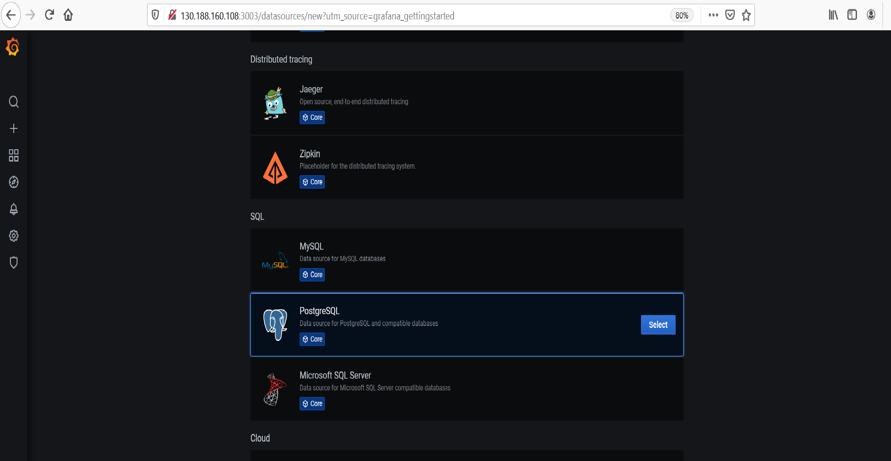
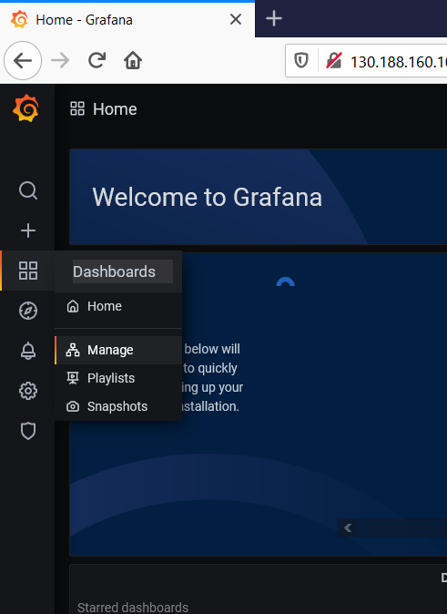
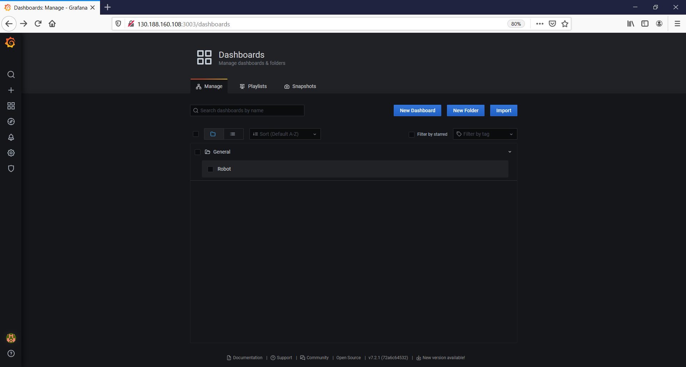
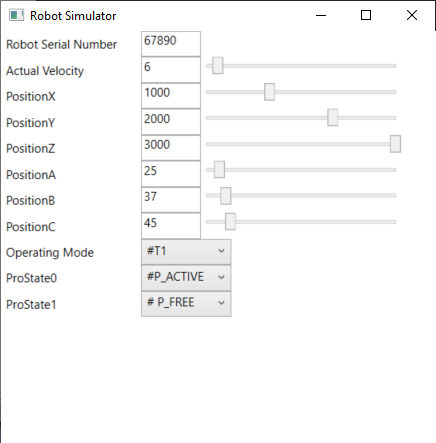

# Quick Start Guide

[Back](../ReadMe.md#gettingstarted)

This page is a guide to test out the component in a quick way. It uses a preconfigured docker-compose file, a grafana dashboard and a preconfigured robotsimulator combined with the RoseAP.

In this you tube channel you can find videos demonstrating the step by step tutorial.

- [https://js2sf.readthedocs.io/en/latest/getting-started.html#installation-in-windows](https://www.youtube.com/watch?v=npqQ6tkVAN0) isRoseAP PartI SoftwareInstallation
- [explanation](https://js2sf.readthedocs.io/en/latest/getting-started.html#installation-in-windows)
- [RoseAP PartII Starting the OrionContextBroker](https://www.youtube.com/watch?v=CTJp41MulPg)
- [RoseAP PartIII Configuring Grafana part1](https://www.youtube.com/watch?v=ISLZedSzbX0). At the end of this video you i run into a configuration problem. In the next video (RoseAP PartIVConfiguring Grafana part2) you can find the correction i had to make.
- [RoseAP PartIVConfiguring Grafana part2](https://www.youtube.com/watch?v=vVRnSDgO8ZU)
- [RoseAP PartV Settingup the RoseAP + Robotsimulator](https://www.youtube.com/watch?v=BpVdY4MrLMw)
- [RoseAP PartVI Atomic tests](https://www.youtube.com/watch?v=Yc3v1ncs2xE)
- [RoseAP PartVII Clean up the containers](https://www.youtube.com/watch?v=eZWRKvjKiwA)


In order to run the preconfigured test with the robotsimulator, you need to follow the following steps :


### Installation in Windows<a name="installation"></a>


First install following softwares to get the demo/test environment  running :

- Download cygwin tools on windows from https://www.cygwin.com/.

  Safe the installation file in a directory on your pc . 

  Install cygwin tools on windows, accept all default suggestions during installation

  After installation of Cygwin, add the dos2unix command to cygwin :

  - ​	Open a cmd window
  - ​	Browse to the directory where he cygwin  installer is located
  - ​    Execute following command :  setup-x86_64.exe -q -P dos2unix

- Install Docker Desktop on Windows from https://docs.docker.com/docker-for-windows/install/, choose a Hyper-V backend.

- Create a directory c:/KukaConnectivityKit and  copy the project files from the github repository to this location.


### Start the Orion Context Broker<a name="starttheorioncontextbroker"></a>


- Start a cygwin terminal and go to the folder containing the docker-compose.yml file, for example:
```
  cd /cygdrive/c/KukaConnectivityKit/docker
```
  Make sure the script files have Linux line endings by executing :
  ```
  dos2unix DataGeneratorRoseAP
  dos2unix services
  ```
  To get the Orion Context Broker running a service script is provided to easily create, start and stop the containers. 

  To obtain the necessary Docker images locally use (this needs to be executed only once):
  ```
  ./services create
  ```
  To initialise and startup the Fiware Orion Context Broker containers use:
  ```
  ./services start
  ```
  You can test if the Orion Context Broker is running with:
  ```
  curl localhost:1026/version
  ```


If the installation went well you'll get some Orion version information
  Also Cratedb, Quantumleap and Grafana should be running by now. 

To create all entities and notifications on the Orion Context Broker a bash script file is prepared. Execute it using the following command :

```
./DataGeneratorRoseAP
```

Now the Orion Contect Broker is up and running.


### Grafana<a name="grafana"></a>


- The docker-compose file has started an instance of the Grafana UI listening on port 3003, so the login page can be found at: http://localhost:3003/login. The default username is admin and the default password is admin.

- Following steps allow you to configure grafana and use the predefined dashboard :
  - Connect with cratedb

    - After logging in, a PostgreSQL datasource must be set up at http://localhost:3003/datasources with the following values:

    - ```
      Name CrateDB
      Host crate-db:5432
      Database doc      // doc is the default database for subscriptions without service-path
      User crate
      SSL Mode disable
      ```

  

  

  - Import the dashboard (C:\KukaConnectivityKit\docker\robot.json) into the grafana environment .

    - On the left side of the screen select the Dashboards -> Manage option

    

    

    - Look for the import button and browse to the robot.json file
    - 
    - Select the robot dashboard. Now tselect the correct serial number of the robot and you will see the actual state of the robot values.

    

  

  

### RoseAP<a name="roseap"></a>


- The RoseAP is running in the windows environment so edit the configuration file of the RoseAP (RoseAPSettings.xml) using notepad for example.
  - Look up  the RoseAPSettings.xml file in the folder "C:\KukaConnectivityKit\bin\" and edit the file. Following tags have to be completed :
    - ContextBrokerUrl : replace the IP address and port to the location of your Context Broker running in Docker, ( for example http://192.168.16.40:1026/)
    - LocalAddress: Set it to the IP address of the current PC.
    - RemoteAddress: Set it to the IP address of the current PC for the robot simulator, or use the IP address of your Kuka Robot.

```
<?xml version="1.0"?>
<RoseAPSettings xmlns:xsi="http://www.w3.org/2001/XMLSchema-instance" xmlns:xsd="http://www.w3.org/2001/XMLSchema">
  <ContextBrokerUrl>http://192.168.16.40:1026/</ContextBrokerUrl>
  <TimerTickInterval>3000</TimerTickInterval>
  <LocalAddress>200.0.0.116</LocalAddress>
  <RemoteAddress>200.0.0.100</RemoteAddress>
  <TCP_Used>true</TCP_Used>
  <TCP_LocalPort>9901</TCP_LocalPort>
  <TCP_RemotePort>9903</TCP_RemotePort>
  <UDP_Used>false</UDP_Used>
  <UDP_LocalPort>9902</UDP_LocalPort>
  <UDP_RemotePort>9904</UDP_RemotePort>
  <NetworkTimeout>2000</NetworkTimeout>
  <Enabled>true</Enabled>
  <ConfigDatPath>C:\Optidrive\HMISETTINGS\P0296_ROSE-AP\$config.dat</ConfigDatPath>
</RoseAPSettings>
```


- In the directory (C:\KukaConnectivityKit\bin\config.dat) there is a configuration file of the robot. This file is generating the data for the inputs and the outputs of the robotsimulator. When connecting with a real robot this file needs to be replaced with the one of the real robot. 
- First launch the Robotsimulator (C:\KukaConnectivityKit\bin\robotsimulatorui.exe).  When a real robot has to be connected this software does need to run.  In that case first install and configure the KukaConnect software as described in [KukaConnect Installation Guide](.\KukaConnect_InstallationGuide.md), 	[Configuration of Kuka Connect](.\KukaConnect_ConfigurationGuide.md), and [Configuration of the Inputs and outputs of the robot](.\KukaIO_ConfigurationGuide.md)
- Launch the RoseAP (C:\KukaConnectivityKit\bin\kukaconnectRose-ap.exe.)


### Test with the limited robot simulator (live test)

- Browse to the grafana dashboard using the following url (http://localhost:3003). You can see the actual values of all robot variables.
- Play with the data in the simulator and look at the behaviour of the dashboard.   By changing the values in the Robot Simulator, you can see the changing values in the dashboards.
 
 

-  For the predefined test we assume the serial number of the robot to be 67890 reality it will be different of course.


### Test without the robot simulator
The test is done independently from the robotsimulator. So make sure the robotsimulator and the RoseAP are not running anymore otherwise it will possibly overwrite the changes you are trying to realise.  For testing the setup there are two options:


##### Test using example data (bash file)
To acquire example data the bash file, DataGenerator, can be run. This will load some data into the system and can be checked in the Grafana dashboard. We provided two different bash files to show different data flows.


##### Test with c# functions

For this option the functions (written in c sharp, but convertible to json) available for testing (here)

By calling these functions you can change one or more values on the ocb and you can see the reaction of the grafana dashboard. Or you can ask the actual value of some variables on the OCB.

Available functions :

    -  UpdateRobotInfo() : Displays values for the different axes from the robot and also a program name, the total number of pieces and the actual piece number
    - UpdateErrorInfo(5) : raises errornuber 5, message is allways the same (Demo Error)
    
    List of separate functions for every 


​    
​    

### Recommendation to start your tests
In the examples above you can see the variables of the robot which are stored on the Orion Context Broker. When using the function  UpdateRobotInfo() you can update the values of the items on the OCB.
In the grafana dashboard you can find back the values you have put in the OCB.


###  Stop the Orion Context Broker

Following commands are available to stop the Context Broker. They have to be executed in the cygwin window which is used to launch the Context Broker.

To stop the containers (data will be preserved) use :

```
./services stop
```
To clean up all data and images use (note that this will also remove your Grafana configuration) :
```
docker-compose --log-level ERROR -p fiware down -v --remove-orphans
```

